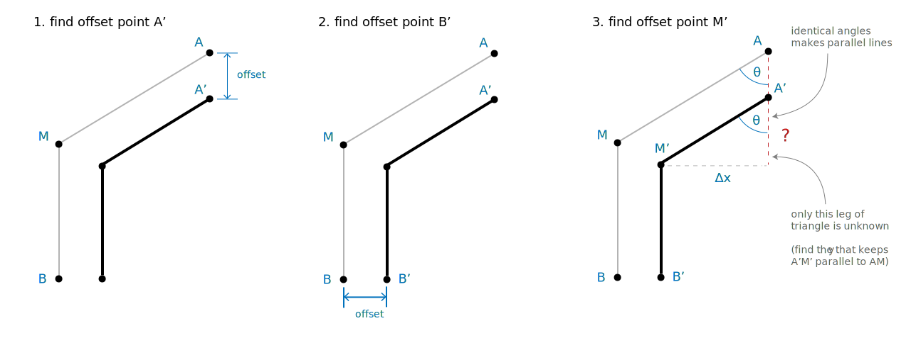

The other day I discovered
[r2d3.us's Visual Introduction to Machine Learning](r2d3). It's a
really beautiful piece of work, coordinating just enough explanatory
text with some of the best visual explanations I've ever seen. You
should [definitely check it out](r2d3).

The final interactive diagram is a standout. It is an animation of the
examples in the dataset flowing through the decision tree and
collecting into two separate groups. It's mesmerizing to watch, its
both informative and beautiful, and it's exactly the sort of visual
I've wanted to apply to other sorts of data.

I wanted to figure out how the designer [Tony Chu]() made this
visualization work, so I dug into the code and decided to rebuild
it. Now I know how to build things like this on my own, and if you
follow along, you can learn too. Here we go.

# Reading the R2D3 code

The whole [r2d3]() page is a [Backbone]() application, and nearly all
the code is in the file
[main.js](http://www.r2d3.us/static/pages/decision-trees-part-1/main.js). The
part we are interested is the `AnimatedClassifierView` which does all
interesting work to display the animation. The associated
`AnimatedClassifer` just pipes the right data into the view.

# Tree

The fun part we are headed for is animating the samples as they flow
down the tree, but first things first. We need something for the
samples to flow on. We need to build the tree.

We delegate the main magic to
[`d3.layout.tree.nodes()`](https://github.com/mbostock/d3/wiki/Tree-Layout#nodes). It
finds node positions in relative units (0 to 1) so that the layout of
nodes reflects the parent-child relationships.

# Samples

[r2d3]: http://www.r2d3.us/visual-intro-to-machine-learning-part-1/
[Backbone]: http://backbonejs.org/
[Tony Chu]: http://tonyhschu.ca
